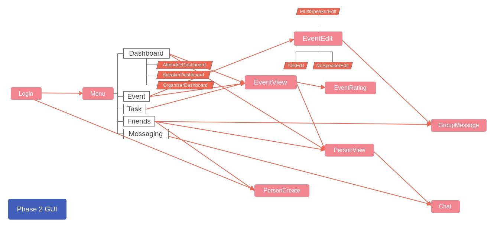

- [Install Instructions](#install-instructions)
- [Important Detail](#important-detail)
- [Entities and Noun](#entities-and-noun)
- [Feature List](#feature-list)
- [Design Patterns](#design-patterns)
- [Development Team (group_0238)](#development-team-group_0238)

# CSC207 Conference Project

This project is the final assessment of University Of Toronto `CSC207` Fall 2020.

The program is developed with the intent of helping to solve a series of problems and situations people may encounter during event management.

In the project many tools has used to have an overview of schedule for various events, and to allow people
including Organizers, Speakers, and Attendees at a conference to communicate with each other.

## Important Detail

The UML Class Diagram is located in `phase2/design` folder.

The list of feature we implemented are located below in the [Feature List](#feature-list) section.

The list of design pattern employed are located below in the [Design Patterns](#design-patterns) section.

After the program finishes, the session is deserialized and stored at `phase2/session/Session.ser`.

> Notice that there is a demo session at `phase2/session/Session_demo.ser`, that is used during the demonstration video. If you want to have a look yourself, on line 17 of `ConferenceSystem` change `SESSION_PATH` to `"./session/Session_demo.ser"`.

Every time the program starts, it tries to restore the session by serializes the `Session.ser`. For any reason, if the program failed to find such file, it will automatically load a sample session, which contains the following account to save you time when trying out features:

| Type      | Username | Password |
| --------- | -------- | -------- |
| Organizer | org1     | 1        |
| Organizer | org2     | 2        |
| Speaker   | spk1     | 1        |
| Speaker   | spk2     | 2        |
| Speaker   | spk3     | 3        |
| Attendee  | att1     | 1        |
| Attendee  | att2     | 2        |
| Attendee  | att3     | 3        |
| Attendee  | att4     | 4        |

## Install Instructions

We have 4 external dependencies:

- `itextpdf-5.5.6` : PDF Rendering (pre downloaded in `lib` folder)
- `xmlworker-5.5.6` : PDF Generating (pre downloaded in `lib` folder)
- `Javafx-11.0.2` : The GUI framework (follow [this link](https://gluonhq.com/products/javafx/) to download, then unzip)
- `Controlfx-11.0.3` : An extension to `Javafx` (pre downloaded in `lib` folder)

> Notice that you need `Java 11` or later!

First Open Intellij then open the project on the `phase2` folder. (This step is important because all the folder we are referencing below is from the `phase2` folder).

Now locate the `lib` folder, then open `Project Structure` in Intellij IDEA, in the `Project` tab choose `Java 11` or later as `Project SDK`. 

Then click on `Libraries` tab, then click the `+`  on the top-left comer of the interface, then choose `Java` from the drop down, then select the `lib` folder, then `OK`. 

Now click on the `+` again, then select the `openjfx-xxx/lib` folder you downloaded previously (add the `openjfx-xxx/lib` folder not the `openjfx-xxx` folder).

Then we need to modify the run configuration before we can properly run the program. In Intellij, the easiest way is to first run the program once, notice this run WILL output error messages, but you can ignore it, the purpose of this is to let Intellij to auto configure some things for us.

Go to `src/controller/session/ConferenceSystem.java` on line 12, you can see the main method and a green run button on the left, click on it then select `Run 'ConferenceSystem.main()' ` (or you can right click on anywhere in the `ConferenceSystem.java` then select the option from the drop down). Now the console may output a bunch of errors THIS IS OK!

Now on the top bar you should see something like this:


Click on the drop down, then select `Edit Configuration` then in `VM Options` copy and paste the following lines:

```
--module-path
>>>>>>>>>>>>Replace this with Javafx sdk lib folder path on your computer<<<<<<<<<<<<
--add-modules
javafx.controls,javafx.fxml
--add-exports
javafx.graphics/com.sun.javafx.sg.prism=ALL-UNNAMED
--add-exports
javafx.controls/com.sun.javafx.scene.control.behavior=ALL-UNNAMED
--add-exports
javafx.controls/com.sun.javafx.scene.control.inputmap=ALL-UNNAMED
--add-exports
javafx.graphics/com.sun.javafx.scene.traversal=ALL-UNNAMED
--add-modules
javafx.swing,javafx.graphics,javafx.fxml,javafx.media,javafx.web
--add-reads
javafx.graphics=ALL-UNNAMED
--add-opens
javafx.controls/com.sun.javafx.charts=ALL-UNNAMED
--add-opens
javafx.graphics/com.sun.javafx.iio=ALL-UNNAMED
--add-opens
javafx.graphics/com.sun.javafx.iio.common=ALL-UNNAMED
--add-opens
javafx.graphics/com.sun.javafx.css=ALL-UNNAMED
--add-opens
javafx.base/com.sun.javafx.runtime=ALL-UNNAMED
```

Notice you need to replace the second line with the `openjfx-xxx/lib` path on your computer!

Now try to run the project again, you should be greeted with the login screen!

## Entities and Noun

- `Event` 

	`Talk`, `NonSpeakerEvent`, `MultiSpeakerEvent` 

	These are different kinds of _event_ that happens at the conference. Where `Event` is the parent class of the other three. An `Event` can only be added to `Schedule` of the conference.

- `Task`

	`Appointment`, `SpeakerDuty`

	These are different kinds of _tasks_. Where `Task` is the parent class of the other two. A `Task` can only be added to `Schedule` of a person. A task is essentially an _wrapper_ for an `Event`, meaning every task correspond to one event (but an event could have many tasks), they share the same `location`, `startTime`, `endTime`. The reason why we have `Task` is to adapt the `Event` so that they can be added to the schedule of a person.

	An example use: every time an organizer assigns a speaker to some event, an `SpeakerDuty` is added to the speaker’s `Schedule`. This way the `Schedule` of that speaker can ensure the speaker is available at the desired location and time, and no further `Task` of other events can be added to that occupied location and time, i.e. no double booking of speaker.

- `Person`

	`Organizer`, `Speaker`, `Attendee`, `VIPAttendee`

	These are different kinds of `person` or `people` of the conference. Where `Organizer` can _organize_, and `Speaker` can _speak_, and `Attendee` can _attend_. The `VIPAttendee` is a special kind of attendee, where they have a more than certain amount of `points`. You can earn `points` by `signup` to some events.

- `IEvent`

	This is the parent class of `Task` and `Event`. An `Schedule<E extends IEvents>` object stores a list of `IEvents`, here we utilize generic in java to avoid casting.

- `OccupancyLevel`

	This is an `enum`, represents how much does an `IEvent` occupies the location and time it specifies on an `Schedule`.

	- `OCCUPANCY_NO`

		The `IEvent` with this type of occupancy _does not_ occupy the time and location it defines. Meaning other `IEvent` can still be added to this time and location. For example, an `Appointments` haves no occupancy.

	- `OCCUPANCY_SPECIFIC`

		The `IEvent` with this type of occupancy _only_ occupy the time and location it defines. Meaning other `IEvent` can’t occupy this time period at this location specifically, but they can still occupy other time period at this location or other location at this time period. For example, `Talk`, `NonSpeakerEvent`, `MultiSpeakerEvent` has specific occupancy, because there can be other `IEvent` added, but needs to be on another location or time.

	- `OCCUPANCY_ABSOLUTE`

		The `IEvent` with this type of occupancy occupies _all location at this time period simultaneously_. Meaning no other `IEvent` can occupy any location at this time period. For example an `SpeakerDuty` has absolute occupancy, because it needs to ensure the speaker is available at the time and location of the event, so does not allow them to have other things at the same time period.

- `Relationship`

	A relationship is basically a mutable integer, it contains a non-negative integer `layer` representing how “deep” this relation is, if `layer == 0` represents no relation, if `layer >= 1` represents has relation.

- `Message`

	`StringMessage`

	A Message represents a communication from someone. It contains it’s `content`, and a `sender`, and `time`. This object is immutable, thus it’s safe to reference from multiple sources. All messages are contained in an `ChatRecord`.

## Feature List

### Features Inherited from phase 1

#### Schedule System

Allows the Organizer to schedule different types of events without worrying about double-booking a location, or double-booking a speaker.

Our program uses an `Schedule<E extends IEvent>`, which ensures no conflicting `IEvent` can be added to a Schedule, based on it’s time, location and the `OccupancyLevel`.

Here `IEvent` is a parent class of all different events, and all tasks 

There are two usage of Schedule, each enforces a feature.

- An `Schedule<Event>` for the conference where only contains `Event` objects. This is used to ensure _no double booking of location and time_.
- An `Schedule<Task>` for each person. This is used to ensure _no double booking of speaker_.

#### Login System

Allows different types of user to login, and interact with the respective menu interface.

#### Sign-Up System

Allow Attendees to sign up to events, and see the schedule of all events.

#### Messaging System

Allows various types of messaging:

- from Speaker/Organizer to all signed up attendees
- from Organizers to all Speakers/all Attendees
- from Anyone to Anyone else as long as they have some relation (being friends or one is “working” with another)

#### Saving and Persistence of Information

The program automatically saves all information to a `.ser` file, this feature utilizes the `Serializable` interface builtin to `java`.

---

### Feature Removed from phase 1

#### Text UI

In phase 2, the Text UI is replaced by a GUI implemented using `Javafx`.

---

### New Features in phase 2

#### Events Improvement (Mandatory extensions 1, 5)

Now we have `Talk` (from phase 1), and the newly introduced `NonSpeakerEvent`, `MultiSpeakerEvent`. In addition, they can be an `Vip` events if they have some `requirements` to enrol.

There are also some new parameters to an Event, here is the complete parameter list:

| Parameter     | Meaning                                                      |
| ------------- | ------------------------------------------------------------ |
| `title`       | The title of the event, two event with the same title is considered __recurring events__. |
| `speaker`     | The speaker of the event, this field could be different depending on the type of event you create. `Talk` has exactly one speaker, `NoSpeakerEvent` has no speaker, and `MutiSpeakerEvent` has multiple speakers. |
| `organizer`   | The organizer who created this event.                        |
| `capacity`    | (NEW) This is an number that defines the upper bound of how many people can enrols in this event. This is used to enforce mandatory extension 5. |
| `location`    | Where this event happens.                                    |
| `startTime`   | When this event starts.                                      |
| `endTime`     | When this event ends.                                        |
| `reward`      | (NEW) The reward of this event, people who signed up for this event can earn points defined by this amount. After the attendee has reached a certain amount, they are _promoted_ to an `VIPAttendee`. If the attendee cancelled the appointment, they lose this amount, and also might _demote_ them to an regular `Attendee`. |
| `requirement` | (NEW) The required amount of points an person has to meet in order to attend this event. If this number is greater than 0, then this event is considered as VIP event. |

#### Cancel Event (Mandatory extensions 2)

Now event can be cancelled by the organizer who created it, but only before the events has started.

#### More Types of Person (Mandatory extensions 3)

Now every person has a `points`, where they can _earn_ by attending events. If their points accumulates high enough, they will be _promoted_ to an `VIPAttendee`. If their points ever drops below the threshold (by cancelling the appointments to some events) they will be _demoted_ to a regular attendee.

#### Organizer Create Accounts (Mandatory Extension 4)

Previously, organizer can create speaker accounts. Now organizer can create `Speaker`, `Organizer`, `Attendee` accounts! Notice that they can’t create an `VIPAttendee`.

---

#### Schedule Output and Filtering (Optional Extension 3)

Now everyone has an option to save the schedule of all events as PDF. On the `Event` tab located on the GUI, you can also have options of searching a specific keywords and selecting which they want to search, here is a screenshot:


On the left drop down, you can select a numbers of options, and the keyword you entered on the right text field would be specific to that search property only.

- All: search everything, any event that satisfied one of the following would be presented.
- Type: search for a type, i.e. “Talk”, “NonSpeakerEvent”, “MultiSpeakerEvent”.
- Title: search for a title.
- Speaker: search for a Speaker’s name.
- Organizer: search for an Organizer’s name.
- Location: search for a location.
- Time: search for a time range, for example: “12:00~13:00” which match all events between 12:00 to 13:00. This feature is implemented using regex.

#### Scoring (Rating) and Statistic (Optional Extension 7)

Scoring system is a supplementary system for providing useful statistic for an Organizer.

> Scoring System: when an event has finished (when the end time has passed), all attendees would have an option to give a rating for that event. The rating is from 0 to 5.
>
> After we received some ratings, we can calculate the event’s overall rating as the average rating given by the attendees of that event.
>
> The Speaker’s Rating is given as the average rating of all event’s rating that he is a speaker of.

The statistic we present to the organizers is the top 5 performing speakers, that is the 5 speakers with the highest score.

This info is useful to the organizers, it tells the organizers which speaker is popular, and may helps out the organizers to decide which speaker to assign to the event.

This info is displayed by a bar chat on the _Dashboard_ of all Organizers.

#### GUI (Optional Extension 8)

The GUI Framework we choose is `JavaFx`, using the MVC Structure.

The Views are written in `FXML` files, and each linked to a specific Controller written in plain java. Here is the relationship of between the stages:



---

#### Recommending System (Create Your Own Extensions)

The recommending system uses [Collaborative Filtering](https://en.wikipedia.org/wiki/Collaborative_filtering) algorithms to _predict_ the user's preference based on other users with similar preferences. Then recommend the recurring events of the events that the user is _predicted_ to like. Such similarity between users is captured by calculating the [Centered Cosine Similarity](https://en.wikipedia.org/wiki/Cosine_similarity) on their preference vectors. The user’s preferences is the user's rating of the events and is collected by the Scoring System.

There are two main component of the Recommending system:

- Recommend friends to Attendees.

	We recommend a list of people that has a similar preference with the attendee who is logged in.

- Recommend events to Attendees.

	Suppose we are recommending events to an attendee “A”. We first make predictions using collaborative filtering on the preference of “A” to all Events that “A” doesn't have a chance to attend. We recommend the recurring events of the events that “A” is predicted to like.

Both of these recommendations are presented on the Attendee’s _Dashboard_.

## Design Patterns

### Visitor Design Pattern

Visitor provides the ability extend a feature without modifying the original class. It also avoids the usages of `instanceof` and casting.

- `entity.comm.MessageVisitor`

	- `usecase.commu.chat.manager.facade.MessageValidator`

		Check if a `Message` is valid.

	- `usecase.commu.chat.manager.facade.ChatRecordConvert`

		Convert `Message` to Message Data Transfer Object (`MessageDTO`), to be supplied to the presenter.

	- `usecase.commu.facade.MessagingConvert`

		Convert `List<ChatManager>` to Chat Data Transfer Object (`ChatDTO`), to be supplied to the presenter.

- `entity.event.EventVisitor`

	- `usecase.download.facade.EventDownload`

		Convert the schedule of events to an HTML formatted string to be outputted as an PDF file (with `gateway.PDFGenerate`).

	- `usecase.event.facade.EventChange.SpeakerChange` (private nested class)

		Apply the change of speaker in an event. The reason for having a visitor is that we have different types of events, some have one speaker, some have no speaker, some have multiple speaker.

	- `usecase.event.facade.EventChange.EventUpdater` (private nested class)

		Update the change in event reflected on Speaker’s Task, Speaker’s announcement access, relationship, etc.

	- `usecase.event.facade.EventConvert`

		Convert the `Event` to Event Data Transfer Object, to be supplied to the presenter.

	- `usecase.event.facade.EventCreate.AnnouncementEnroll` (private nested class)

		Update the Announcement Access for the speaker.

	- `usecase.event.facade.EventCreate.AttendeeRelationUpdate` (private nested class)

		Update the Attendee’s Relation  to speaker and organizer when removing.

	- `usecase.event.facade.EventCreate.EventBuilderFactory` (private nested class)

		Construct an event builder based on the event.

	- `usecase.event.facade.EventCreate.SpeakerTaskUpdate` (private nested class)

		Update the speaker’s task when creating.
		
	- `usecase.event.facade.EventExtract.ExtractSpeaker` (private nested class)

		Extract the speaker of some event, as a list.

	- `usecase.event.facade.EventSignup.SpeakerWorkRelationUpdate` (private nested class)

		Update the work relation of the speaker.

	- `usecase.event.facade.EventTypeDistributor.EventTypeExecutor` (private nested class)

		Execute the `EventTypeVisitor` which is a visitor wrapper for the event visitor. 

	- `usecase.event.facade.EventView.SpeakerMatch` (private nested class)

		Match the speaker of the event by a predicate.

	- `usecase.event.facade.EventView.TypeMatch` (private nested class)

		Match the type of the event.

	- `usecase.recommand.facade.EventRecommendConvert`

		Convert the `Event` and it’s prediction to `EventRecommandDTO`, to be supplied to the presenter.

	- `usecase.score.facade.SpeakerScoreCalculate`

		Calculate the speaker’s score of that event.

- `entity.people.PersonVisitor`

	- `usecase.people.facade.PeopleConvert`

		Convert the `Person` to Person Data Transfer Object, to be supplied to the presenter.

	- `usecase.people.facade.PeopleCreate`

		Create a person, and setup them based on their type.

	- `usecase.recommand.facade.PeopleRecommendConvert`

		Convert `Person` and it’s similarity to `PersonRecommandDTO`, to be supplied to the presenter.

- `entity.task.TaskVisitor`

	- `usecase.task.facade.TaskConvert`

		Convert `Task` to Task Data Transfer Object (`TaskDTO`), to be supplied to the presenter.

- `usecase.event.EventTypeVisitor`

	This is basically a wrapper for `EventVisitor`. Since the controller shouldn’t access the entity directly, if they want to do operation specific to a type of event, also want to avoid `instanceof` as much as possible.

	- `controller.dialogs.eventEdit.EventInitVisitor` (private nested class)

		Load the edit interface based on the type of the event selected.

### Facade Design Pattern

Facade are used inside the use cases, where one manager does too many things (i.e. has more than one factor to change), thus we use Facade design pattern. Where each sub component is only responsible for a single task.

- Facade : `usecase.commu.MessagingManage`

  - `usecase.commu.GroupMessaging`

  	Sending message to multiple people at once.

  - `usecase.commu.MessagingConvert`

  	Convert `Message` to `MessageDTO`.

  - `usecase.commu.MessagingCreate`

  	Handle creating `ChatManager`.

  - `usecase.commu.MessagingView`

  	Update the view of a list of `ChatManager`.

- Facade : `usecase.commu.chat.manager.ChatManager`

	- `usecase.commu.chat.manager.facade.ChatRecordConvert`
	
		Convert `ChatRecord` to `List<MessageDTO>`.
	
	- `usecase.commu.chat.manager.facade.MessageValidator`
	
		Check the validity of the message.
	
- Facade : `usecase.download.DownloadManage`

	- `usecase.download.facade.EventDownload`

		Convert list of `Event` to HTML formatted style to output.

- Facade : `usecase.event.EventManage`

	- `usecase.event.facade.EventChange`

		Handle changes made to Event.

	- `usecase.event.facade.EventConvert`

		Convert `Event` to `EventDTO`.

	- `usecase.event.facade.EventCreate`

		Handle create / remove events.
		
	- `usecase.event.facade.EventExtract`

		Extract some info of an event.

	- `usecase.event.facade.EventSignup`

		Handle sign up / cancel sign up to an event.

	- `usecase.event.facade.EventTypeDistributor`

		Distribute the `EventTypeVisitor`.

	- `usecase.event.facade.EventView`

		Update the view of a list of events, include applying the `EventSearchProperty` and `keyword` as a filter.
	
    - `usecase.event.facade.RecurringEventCheck`

        Get the recurring event of a given event.
	
- Facade : `usecase.event.PeopleManage`

	- `usecase.people.facade.PeopleConvert`

		Convert `Person` to `PersonDTO`.

	- `usecase.people.facade.PeopleCreate`

		Handle create person.

	- `usecase.people.facade.PeopleFilter`

		Handle filter a list of people by some constrains.
	
	- `usecase.people.facade.PeopleLogin`
	
		Handle login.
	
	- `usecase.people.facade.PeopleView`
	
		Update the view of a list of people.
	
	- `usecase.people.facade.VIPPromote`
	
		Handle promotion / demotion of person.
	
- Facade : `usecase.recommand.RecommendManage`

	- `usecase.recommand.facade.CollaborativeFiltering`

		Make the prediction on recommending event.

	- `usecase.recommand.facade.EventRecommendConvert`

		Convert to `EventRecommendDTO`.

	- `usecase.recommand.facade.PeopleRecommendConvert`

		Convert to `PeopleRecommendDTO`.

	- `usecase.recommand.facade.SimilarityCalculate`

		Calculate the similarity of two user based on their preference.

- Facade : `usecase.score.ScoreManage`

	- `usecase.score.facade.SpeakerScoreCalculate`

		Calculate the speaker’s score.

- Facade : `usecase.statistic.IStatistic`

	- `usecase.statistic.facade.SpeakerScoreConvert`

		Convert to `SpeakerScoreDTO`.

- Facade : `usecase.task`

	- `usecase.task.facade.TaskConvert`

		Convert `Task` to `TaskDTO`.

	- `usecase.task.facade.TaskCreate`

		Handle create tasks.

	- `usecase.task.facade.TaskView`

		Update the view of a list of task.

### Factory Design Pattern

Factory are used to hide the creation process of a complicated object. Here factory are used to create multiple entities.

- `entity.comm.factory.MessageFactory`

    Create a `Message` given an `Object`, and set the current time as `time`.

- `entity.person.factory.PersonFactory`

    Create a `Person` given the name. Provide a method to transform a `VIPAttendee` to `Attendee` and `Attendee` to `VIPAttendee`, this two method are used when promoting or demoting a person.

- `entity.task.factory.TaskFactory`

    Create a `Task` given an `Event`, it set the necessary information from an `Event` to newly created `Task`.
    
### Builder Design Pattern

Builder are used to create a complex objects, in step by step fashion.

- `usecase.dto.builder.EventBuilder`

	`TalkBuilder`, `MultiSpeakerEventBuilder`, `NonSpeakerEventBuilder`
	
	Because `Event` is an object that has a lot of parameters, we use a builder to handle its creation process.
	
	Here `EventBuilder` is an abstract class, contains an `build()` method and contains the common parts.

### Observer Design Pattern

Observer are used to listen changes from an Observable, to maintain consistency.

- `usecase.friends.manager.RelationshipObservable`

    `FriendsManage` implements this interface, it gives the options to add to observe friendship change and add to observe work relation change.
    
    - `usecase.friends.manager.RelationshipObserver`
    
        `usecase.commu.chat.manager.DirectChat` is an `RelationshipObserver`, it receives changes to relations, and update the access accordingly.

### Strategy Design Pattern

Strategy are used to hide the implementation detail of a feature. That are we want the class to be independent of a particular implementation.

- `usecase.commu.stragergy.AnnouncementNameStrategy`, `usecase.commu.stragergy.DirectChatNameStrategy`

    Here the algorithm that generates the name of an `Announcement` or `DirectChat` is hidden, this way if we want to change the chat name generation algorithm, we can easily swap out the strategy.

## Development Team (group_0238)

| Name          | UTROid   | Git Name(s)            |
| ------------- | -------- | ---------------------- |
| Hongcheng Wei | weihongc | Hongcheng_Wei, homelet |
| YuHao Yang    | yangy176 | martinyang0416         |
| yi chen liu   | liuyi104 | KKKK123454321          |
| Yue Lan       | lanyue1  | Yue, kat               |
| Yu Sun    	| sunyu32  | Sunny                  |
| Zhexuan Li    | lizhexua | royli142857            |
| Qiyue Zhang   | zhan8055 | Qiyue Zhang, ma521yyy  |
| Peiwen Luo    | luopeiwe | flora-luo              |

Huge thanks to the TAs and Instructors of CSC207 Fall 2020!

Thanks for reading. Best Appreciate from all team members in Group_0238.